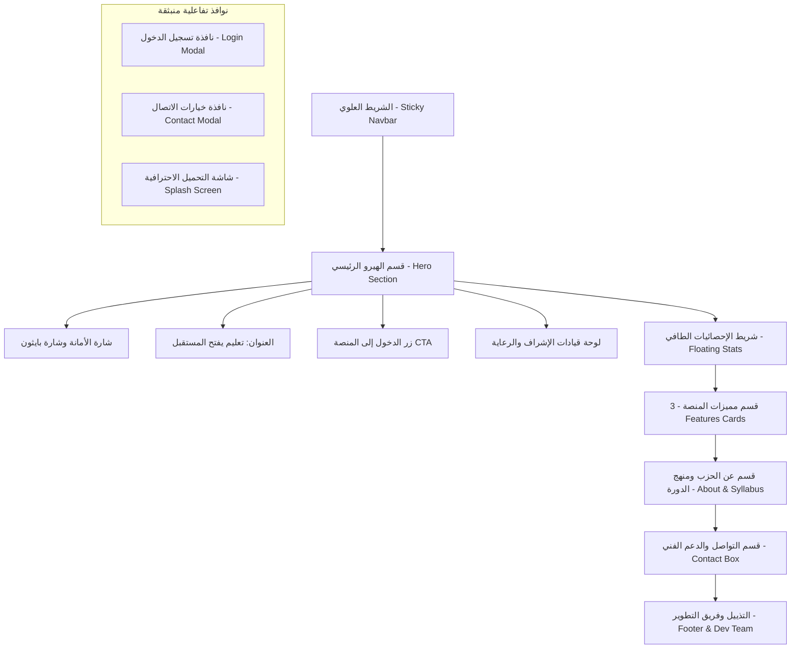

# توثيق وتفاصيل الصفحة الرئيسية العامة (Landing Page Documentation)
**مشروع المنصة التعليمية الرقمية | حزب مستقبل وطن - أمانة أول المحلة الكبرى**

---

## 📌 1. نظرة عامة (Overview)
تُمثل الصفحة الرئيسية (`index.html`) الواجهة التعريفية والتسويقية والمدخل الأساسي للمنصة التعليمية الرقمية التابعة لأمانة شباب أول المحلة الكبرى بحزب مستقبل وطن.
تم تصميم الصفحة لتقدم تجربة مستخدم (UX) سلسة وعصرية للطلاب والزوار، تركز على دورة **Python Programming** المتكاملة والمجانية، وتعكس الطابع الوطني والشبابي الراقي للمبادرة.

* **الملف المصدري:** [`index.html`](file:///home/ibrahim-elshishtawy/flutter%20project/Mostakbal-Watan-Courses/index.html)
* **ملفات الأنماط والتصميم:**
  * [`src/styles/variables.css`](file:///home/ibrahim-elshishtawy/flutter%20project/Mostakbal-Watan-Courses/src/styles/variables.css) (نظام التصميم والألوان الموحد)
  * [`src/styles/landing.css`](file:///home/ibrahim-elshishtawy/flutter%20project/Mostakbal-Watan-Courses/src/styles/landing.css) (تنسيقات الواجهة الرئيسية)
* **ملفات المنطق البرمجي:** [`src/app/landing.js`](file:///home/ibrahim-elshishtawy/flutter%20project/Mostakbal-Watan-Courses/src/app/landing.js)

---

## 🎨 2. نظام التصميم والهوية البصرية (Design System & Visual Identity)

تعتمد الصفحة على ثيم داكن فاخر ومريح للعين (`data-theme="green"` / Dark Neutral Slate):

| العنصر التصميمي | القيمة / الرمز | الوصف والاستخدام |
| :--- | :--- | :--- |
| **الخط الأساسي** | `Cairo` (Google Fonts) | خط عربي معاصر بأوزان (400, 600, 700) عالي المقروئية على كل الشاشات |
| **الخلفية الرئيسية** | `#121519` (`--bg-primary`) | رمادي فحمي داكن يمنح فخامة ويبرز العناصر المضيئة |
| **الخلفية الثانوية** | `#181c22` (`--bg-secondary`) | للبطاقات الداخلية والعناصر المتفرعة |
| **أسطح البطاقات** | `#1f242d` (`--surface-primary`) | لون أسطح الحاويات والبطاقات الرئيسية مع حدود دقيقة |
| **اللون الأساسي (Primary)** | `#10b981` (Emerald Green) | أخضر زمردي هادئ يُعبر عن النماء وشعار الحزب |
| **اللون المميز (Accent Gold)** | `#d97706` / `#f59e0b` | ذهبي دافئ مستوحى من الهوية المصرية لاستخدامه في الكلمات المفتاحية والأوسمة |
| **التأثير الزجاجي (Glassmorphism)** | `rgba(24, 28, 34, 0.90)` مع `backdrop-filter: blur(12px)` | مستخدم في الشريط العلوي (Navbar) والنوافذ المنبثقة |
| **الظلال والانتقالات** | `0 4px 14px rgba(0,0,0,0.35)` | تأثيرات ثلاثية الأبعاد خفيفة مع تحريك ناعم عند مرور المؤشر (Hover Effects) |

---

## 📐 3. الهيكل العام ومخطط الواجهة (Wireframe & Layout)

---

## 🔍 4. تفاصيل محتويات وأقسام الصفحة (Sections Breakdown)

### 1️⃣ الشريط العلوي (Top Navbar)
* **الموضع والنمط:** شريط عائم ثابت في أعلى الصفحة (`position: sticky`) مع حواف دائرية وتأثير زجاجي شفاف.
* **المحتويات:**
  * **شعار وهوية المنصة:** صورة شعار الحزب (`assets/images/logo_union.jpeg`) وبجانبها نص: **حزب مستقبل وطن** وتحته وصف: **أمانة أول المحلة الكبرى**.
  * **قائمة روابط التنقل:**
    * `⌂ الرئيسية` (`#home`)
    * `عن الحزب` (`#about`)
    * `الدورة التعليمية` (`#course`)
    * `تواصل معنا` (`#contact`)
  * **زر الإجراء الرئيسي (`landing-login-btn`):**
    * يظهر كزر "🔐 تسجيل الدخول" للزائر الجديد.
    * يتحول ديناميكياً بفضل كود الجافاسكربت إلى "🚀 الدخول إلى [بوابة الطالب / لوحة المعلم / لوحة الإدارة]" إذا كان المستخدم مسجلاً بالفعل.

---

### 2️⃣ قسم الواجهة الترحيبية (Hero Section)
* **الخلفية:** تدرج داكن مدمج مع صورة خلفية مخصصة (`assets/images/back.webp` / `back.png`).
* **العناصر الأساسية:**
  1. **الأوسمة العلوية (Eyebrow Badges):**
     * `🏛️ حزب مستقبل وطن • أمانة شباب أول المحلة الكبرى`.
     * `🐍 Python Programming • دورة تعليمية مجانية شاملة`.
  2. **العنوان الرئيسي الكبير (H1):**
     * **تعليم** (باللون الذهبي) **يفتح** **المستقبل** (باللون الأخضر).
  3. **الفقرة التوضيحية:**
     * نبذة عن المنصة التعليمية الرقمية الرسمية لأمانة شباب أول المحلة الكبرى، وبدء الرحلة من الصفر حتى احتراف البرمجة.
  4. **زر الدعوة للإجراء (Main CTA):**
     * زر عريض بتصميم بيضاوي (Pill) بلون أخضر زمردي وظل مضيء: "🔐 الدخول إلى المنصة التعليمية".
  5. **لوحة قيادات الإشراف والرعاية (Supervision Cards):**
     * عنوان مميز بنجوم: `⭐ تحت رعاية وإشراف ⭐`.
     * 4 بطاقات أنيقة موزعة في شبكة متناسقة:
       * **مهندس / أحمد الجرواني** (أمين الحزب بمحافظة الغربية).
       * **محاسب / عبدالرحمن النموري** (أمين أول المحلة الكبرى).
       * **أستاذ / محمد الشواف** (أمين تنظيم أول المحلة الكبرى).
       * **محاسب / أيمن وليد** (أمين شباب أول المحلة الكبرى).

---

### 3️⃣ شريط الإحصائيات الطافي (Floating Stats Strip)
* **الموضع:** شريط ممتد يعلو الفاصل بين الهيرو وباقي الصفحة (`margin-top: -36px`).
* **البيانات الإحصائية (4 أعمدة):**
  1. **مجاني 100%:** مبادرة شبابية غير ربحية.
  2. **Python:** لغة البرمجة الأكثر طلباً.
  3. **محتوى تفاعلي:** محاضرات واختبارات دورية.
  4. **متابعة شخصية:** حضور وغياب وواجبات عملية.

---

### 4️⃣ قسم مميزات المنصة (Features Section)
* **العنوان:** "ماذا ستجد في المنصة؟ • تجربة تعليمية برمجية متكاملة" يوضح أن المنصة نظام إدارة تعلم (LMS) متطور.
* **البطاقات الثلاث الكبرى (3 Feature Cards):**
  1. **مسار Python الكامل (🐍):**
     * *المستوى الأول:* أساسيات البرمجة، حل المشكلات، البرمجة كائنية التوجه (OOP)، وبناء مشاريع.
     * *المستوى الثاني:* تصميم واجهات سطح المكتب باستخدام Tkinter وربط قواعد بيانات SQLite.
     * *المستوى الثالث:* بايثون للشبكات والأمن السيبراني، Socket Programming، APIs، وفاحص منافذ.
  2. **اختبارات وواجبات ذكية (📝):**
     * اختبارات تفاعلية، عداد وقت إلكتروني، وتصحيح تلقائي فوري.
     * بيئة اختبار معزولة وخالية من المشتتات مع حفظ تلقائي للإجابات لتفادي انقطاع الاتصال.
     * تقييم مستمر وكشوف درجات فورية وملاحظات مخصصة.
  3. **متابعة الحضور والتقدم (📊):**
     * لوحة تحكم ذكية تعرض معدل الحضور، نسبة إنجاز الدورة، والنتائج التراكمية.
     * تنبيهات عند اقتراب الحد الأدنى للغياب.
     * شهادات إتمام معتمدة للطلاب المجتازين.

---

### 5️⃣ قسم عن الحزب والمنهج الدراسي (About & Syllabus Section)
مقسم إلى عمودين متوازيين بارتفاع متطابق:

* **العمود الأيمن: عن الحزب والرؤية (About Party Box):**
  * وسم الهوية: `🏛️ حزب مستقبل وطن • أمانة أول المحلة الكبرى`.
  * النص التأسيسي للمبادرة لتمكين الشباب وبناء كوادر تكنولوجية رائدة تخدم التحول الرقمي.
  * شبكة من 4 ركائز مدعومة بأيقونات:
    * ⭐ مبادرة شبابية مجانية.
    * 🎯 تأهيل لسوق العمل البرمجي.
    * 💻 تطبيقات ومشاريع حقيقية.
    * 📜 شهادات معتمدة ومتابعة.
  * زر خارجي: "🌐 قراءة نبذة رسمية عن الحزب" (ينقل إلى صفحة الحزب بالغربية على فيسبوك).

* **العمود الأيسر: كورس Python المتكامل (Course Syllabus Box):**
  * عنوان القسم مع وسم ملون: `مجاني بالكامل`.
  * شبكة محتويات المنهج (8 وحدات رئيسية مع علامات تحقق خضراء):
    1. مقدمة في علوم الحاسب والبرمجة
    2. Variables & Data Types
    3. Control Flow & Conditionals
    4. Loops & Algorithms
    5. Functions & Modular Code
    6. OOP & Classes Design
    7. Desktop GUI with Tkinter
    8. Database Integration SQLite
  * زر مباشر للدخول: "🔐 الدخول إلى منصة التعلم".

---

### 6️⃣ قسم التواصل والدعم الفني (Contact Section)
* بطاقة مركزية أنيقة تبرز الشخص المسؤول عن الدعم والاستفسارات:
  * **المحاسب / أيمن وليد - أمين شباب أول المحلة**.
* زرين للتواصل المباشر:
  1. **زر رقم التواصل:** `📞 رقم التواصل: 01099959133` (يفتح نافذة الاختيار بين الهاتف والواتساب).
  2. **زر فيسبوك الرسمي:** `🌐 الصفحة الرسمية على فيسبوك` (رابط مباشر للصفحة).

---

### 7️⃣ تذييل الصفحة وفريق التطوير (Footer & Dev Team)
* **حقوق الملكية:** `جميع الحقوق محفوظة © 2026 • حزب مستقبل وطن - أمانة أول المحلة الكبرى`.
* **بطاقات فريق التصميم والتطوير (Dev Team Cards):**
  * بطاقة **م / إبراهيم الششتاوي**:
    * الدور: برمجة السوفت وير والتطوير.
    * زر تواصل واتساب فوري: `01223070571`.
  * بطاقة **م / أحمد أبو راشد**:
    * الدور: تصميم وتطوير.
    * زر تواصل واتساب فوري: `01020084862`.

---

## ⚡ 5. النوافذ المنبثقة والشاشات التفاعلية (Modals & Splash Screen)

### أ) نافذة تسجيل الدخول (`#login`)
* **التصميم:** بطاقة حوارية (Modal) تظهر في منتصف الشاشة مع تعتيم زجاجي للخلفية.
* **الحقول والخيارات:**
  * حقل رقم الهاتف أو اسم المستخدم (`loginUsername`).
  * حقل كلمة المرور (`loginPassword`) مع زر تبديل إظهار/إخفاء كلمة المرور (`passwordToggle`).
  * مربع اختيار "تذكرني على هذا الجهاز" (`rememberMe`).
  * زر الإرسال `submitLoginBtn` مع سبينر تحميل مدمج.
  * تنبيه لعرض رسائل الخطأ في حال كانت البيانات غير صحيحة (`loginErrorMsg`).
* **إمكانية الإغلاق:** تدعم الإغلاق عبر زر `×`، أو النقر على الخلفية المعتمة، أو الضغط على زر `Escape`.

### ب) نافذة خيارات التواصل (`#contactModal`)
* نافذة منبثقة سريعة تتيح للزائر الاختيار المباشر بين:
  * 📞 اتصال هاتفي مباشر برقم `01099959133`.
  * 💬 محادثة واتساب فورية عبر الرابط `https://wa.me/201099959133`.

### ج) شاشة التحميل الاحترافية (`#loadingScreen`)
* شاشة تحميل فائقة الحداثة (Ultra-Modern Splash Screen) تُفعل أثناء عمليات المصادقة والانتقال:
  * تحتوي على شعار الحزب داخل حلقتين ضوئيتين مداريتين (`orbital ring`).
  * رسالة ترحيبية ديناميكية: "أهلاً بيك 🚀 - جاري التوجيه...".
  * شريحة حالة نابضة مع عد تنازلي بالثواني.
  * شريط تقدم خطي ناعم بتوقيت زمني متزامن (`splash-progress-bar`).

---

## ⚙️ 6. المنطق البرمجي والربط الذكي (JavaScript Architecture)

1. **التهيئة والبيئة (`bootstrapApp()`):**
   * ضبط الثيم واللغة والخطوط الافتراضية عند تحميل الصفحة.
2. **فحص الجلسة الذكي (Smart Session Check):**
   * عند فتح الصفحة، يراقب Firebase Auth حالة تسجيل الدخول تلقائياً عبر `onAuthStateChanged`.
   * إذا كان الزائر مسجلاً مسبقاً، يستخرج النظام الـ Custom Claims والبريد لتحديد الرتبة:
     * `ADMIN` ⬅ توجيه لـ `pages/admin.html`.
     * `TEACHER` ⬅ توجيه لـ `pages/teacher.html`.
     * `STUDENT` ⬅ توجيه لـ `pages/student.html`.
   * يتم تغيير نص أزرار الدخول في الصفحة تلقائياً لتصبح **"🚀 الدخول إلى [لوحة الإدارة / لوحة المعلم / بوابة الطالب]"** وتوجيه المستخدم بنقرة واحدة دون الحاجة لتكرار إدخال كلمة المرور.
3. **معالجة تسجيل الدخول (`AuthController.initLoginForm`):**
   * التحقق من المدخلات، وتفعيل السبينر وشاشة الـ Splash، ونقل المستخدم فور نجاح المصادقة.

---

## 🎨 7. نظام الحركة والأنيميشن الاحترافي (Presentation & Animation Engine)

تم تزويد الصفحة الرئيسية بنظام أنيميشن فائق النعومة والخفة يعتمد على GPU Hardware Acceleration (صفر Layout Shifts مع الحفاظ التام على التصميم بنسبة 100%):

1. **حركات الدخول الافتتاحية (Hero Entrance Choreography):**
   * **الهيدر:** ينزلق بنعومة من الأعلى (`anim-fade-in-down`).
   * **عناصر الـ Hero:** تتتابع صعوداً بنظام Stagger ناعم (`anim-fade-in-up` بتأخيرات زمنية من 100ms حتى 500ms) للشارات والعنوان والوصف وأزرار الإجراءات وشرائح الإحصائيات.
   * **بطاقة المحاكي والأكواد (HUD Simulator Card):** تظهر بحركة تكبير وتلاشي انسيابية (`anim-scale-in`).
2. **ظهور الأقسام مع التمرير (Scroll-Driven Reveals):**
   * استخدام `IntersectionObserver` الحديث لمراقبة ظهور الأقسام والبطاقات (`.reveal-on-scroll`).
   * ظهور متتابع (Staggered Delays من `.stagger-1` إلى `.stagger-8`) لبطاقات القيادة، والمميزات، والوحدات الدراسية الثمانية، وفريق العمل، ومكتب الدعم.
3. **تأثيرات التفاعل المباشر (Micro-Interactions):**
   * **رفع البطاقات ثلاثي الأبعاد:** تأثير `.interactive-hover-card` يرفع البطاقة بمقدار `-5px` مع توهج أزرق سيبراني ناعم وحدود مضيئة دون أي تغيير في أبعاد الصفحة.
   * **وميض الضوء على الأزرار الرئيسية:** تأثير `.btn-shimmer` يمرر حزمة ضوئية ناعمة دورياً كل 5 ثوانٍ على زر تسجيل الدخول الرئيسي.
   * **مؤشر سطر الأوامر:** مؤشر محطة الأكواد `.terminal-cursor` يومض بدقة ليعطي إحساس بيئة التطوير الحية (IDE).
4. **العدادات الرقمية التصاعدية (Smooth Numeric Counters):**
   * عند ظهور شرائح الإحصائيات في الشاشة، تبدأ الأرقام (`+800 ساعة`، `100% مجاناً`، `8 وحدات`) بالعد التصاعدي السلس بنظام `requestAnimationFrame` ومنحنى تسارع ناعم (Ease-Out Quad).
   * **تعزيز تدريجي (Graceful Degradation):** وجود القيمة الرقمية الافتراضية داخل الـ HTML يضمن عرض الأرقام فوراً حتى في حال تأخر أو تعطل الجافاسكريبت.
5. **الإضاءة المحيطية المتحركة (Ambient Orb Drifts):**
   * الكرات الضوئية الخلفية تسبح بحركة انسيابية غير متزامنة هادئة جداً على مدار 16-20 ثانية (`ambientOrbDrift`).
6. **معايير الوصولية وراحة الاستخدام (`prefers-reduced-motion`):**
   * في حال قام المستخدم بتفعيل خيار "تقليل الحركة" في إعدادات نظامه، يتم تلقائياً تعطيل كافة التأثيرات الحركية والانتقالات وجعل العناصر ظاهرة بالكامل بنسبة 100% فوراً.
